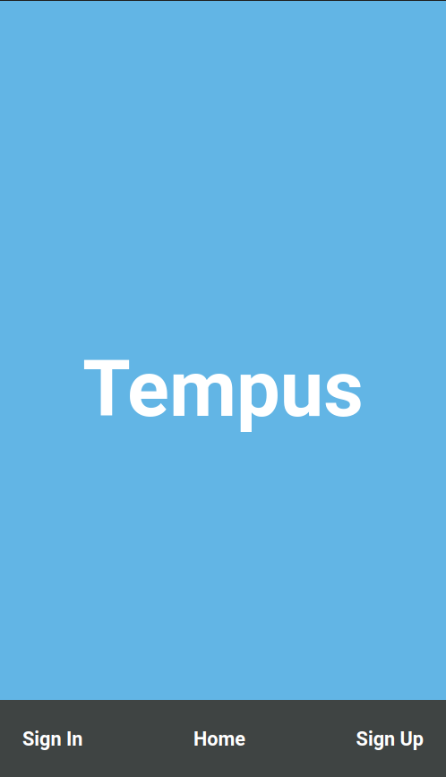
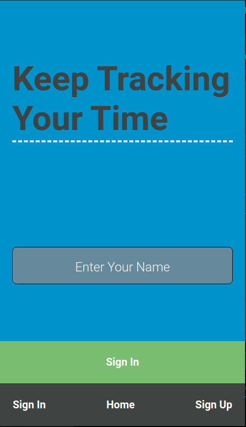
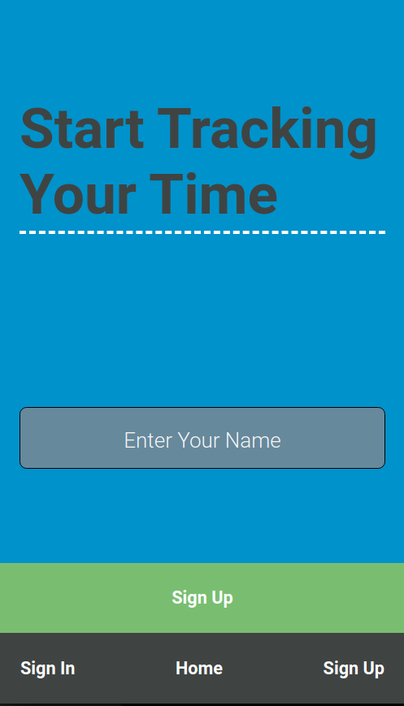
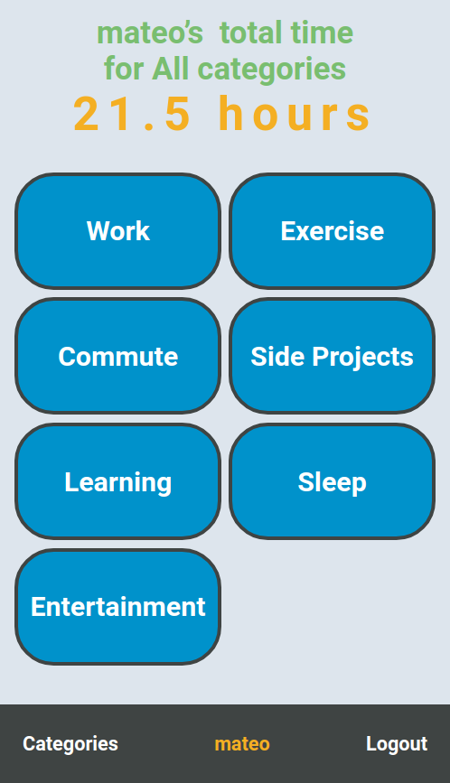
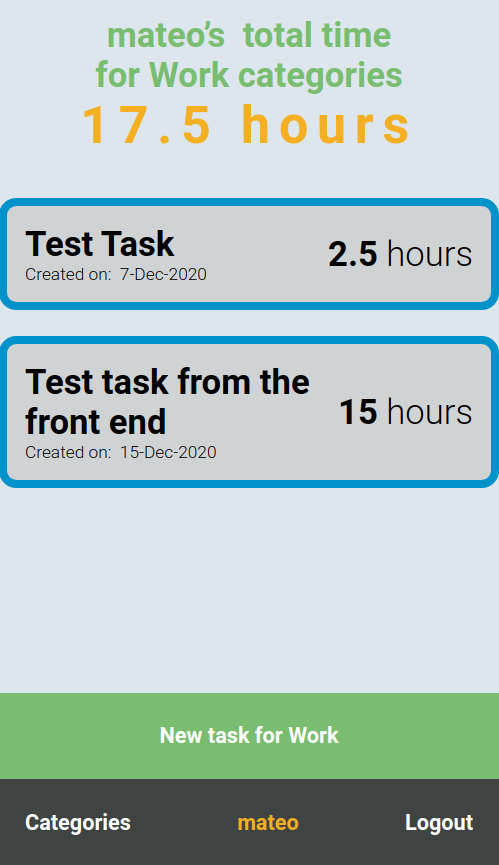
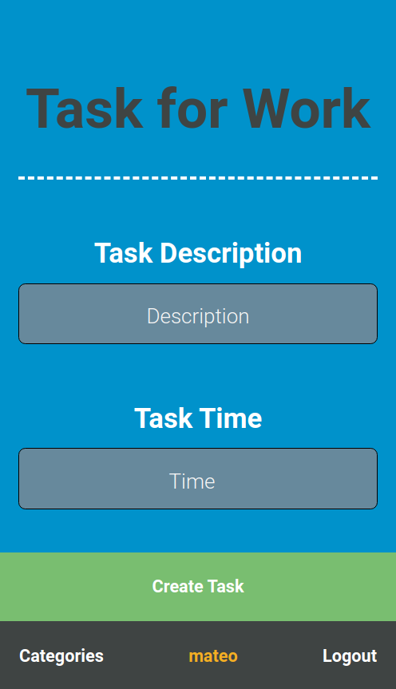

# Tempus Time Tracker

> This project is a time tracker where you can keep track of the time spent in either of the seven categories or in total.

All the information and verifications for the application with the [Tempus API](https://tempus-mm-api.herokuapp.com/) and stored in the application using REDUX. This is a the final capstone project from the Microverse technical curriculum.

Check the [Tempus API repository here](https://github.com/mateomh/tempus-api.git)

## Built With

- React,
- Redux,
- Jest,
- Tempus API

## Live Demo

[Tempus Link](https://tempus-mm.herokuapp.com/)

# How to use it

When you fire up the application you are welcomed by the landing page displaying the name of the app and a navbar at the bottom with the links you can use to access the application.

The Sign In and Sign Up pages are similar, they present the user with a field to put their name in and a button to validate it, the difference between both pages is the legend on top of the name field and the verification it does with the API.

For the sign in the verification is if the user name exists and the legend reads "Keep tracking your time"

While for the sign up page the legend reads "Start tracking your time" and the app verifies with the API that the user name doesn't already exists.

The whole application has a flash notice component that lets the user know about any erros that have occured, displaying a message on the top part of the page for three seconds.

After you log in or signup for the application, you are greeted by the total amount of hours tracked so far for all the categories and a list of the available categories to choose from.

When you select a category a list of the tasks registered for that category will be displayed and the total time will be updated to total amount for that category.

Also a button will show in the bottom part of the page that lets the user add a new task for that specific category.

At the bottom of the page there is a navbar that will give you the chance of going back to the categories list or to logout from the application, the user name is also displayed in the middle of the bar.

After a new task is created the whole application is updated immediately so nothing gets lost.

## Setup Locally

To run the application locally you will need to follow several steps to make it work.

First, you have to check if you have **nodejs** installed on your machine. For this type the following command in your terminal:

> node -v

If **command not found** shows as a response, then go to [nodejs.org](https://nodejs.org/en/) and follow the instructions to install it. After completing the installation the same command should show you a version number.

Then clone the [repository](https://github.com/mateomh/tempus-time-tracker.git) into your local drive and open a terminal in the root folder of the project and install the necessary packages to make it work by running this command:

> npm install

This will get the project ready to run. After this run the following command to start the development server on **localhost:3000/** and wait for the browser to open:

> npm start

If the browser does not open or you close it by accident, but the server is still running you can type **localhost:3000/** in your address bar to get into the application again.

## Tests

This project has a suite of tests built-in.

To run the tests clone the [repository](https://github.com/mateomh/tempus-time-tracker.git) into your local drive, if you haven't done so, and open a terminal in the root folder of the project and install the necessary packages to make it work by running this command:

> npm install

Then you can just run the following command and see the results

> npm test

## Authors

👤 **Mateo mojica**

- Github: [@mateomh](https://github.com/mateomh)
- Twitter: [@mateo_m_h](https://twitter.com/mateo_m_h)
- Linkedin: [Mateo mojica](https://linkedin.com/mateo_mojica_hernandez)

## 🤝 Contributing

Contributions, issues, and feature requests are welcome!

Feel free to check the [issues page](issues/).

## Show your support

Give a ⭐️ if you like this project!

## Acknowledgments

- Microverse
- Heroku

## 📝 License

This project is [MIT](https://opensource.org/licenses/MIT) licensed.
